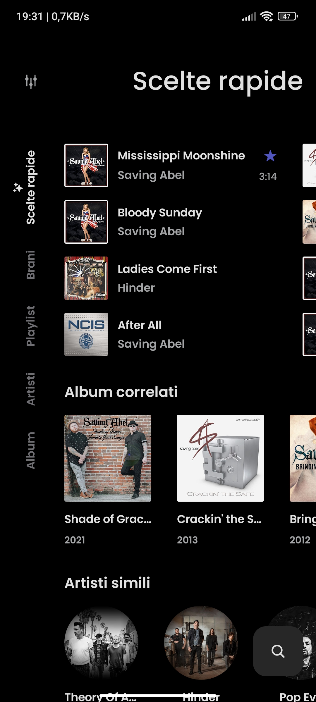
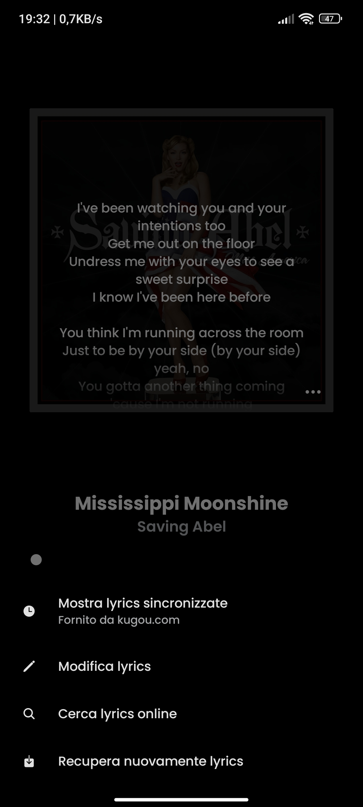
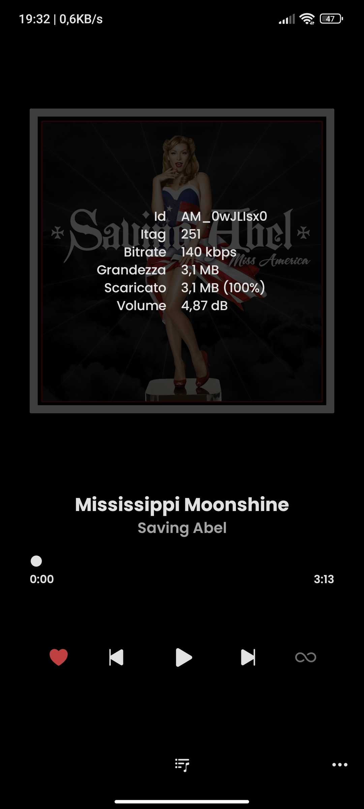

    
    <h1>RiMusic</h1>
    
A <b>multilingual</b> Android application for streaming music from YouTube Music

---
## Features
- Play song (or video under development) from YouTube Music
- Background playback
- Cache audio chunks for offline playback
- Search for songs, albums, artists videos and playlists
- Bookmark artists and albums
- Import playlists
- Fetch, display and edit songs lyrics or synchronized lyrics
- Local playlist management
- Reorder songs in playlist or queue
- Light/Dark/Dynamic theme
- Skip silence
- Sleep timer
- Audio normalization
- Android Auto
- Persistent queue
- Open YouTube/YouTube Music links (`watch`, `playlist`, `channel`)
- **Multilingual support**, English, Italian,  
- ...
## Screenshot
<h4>Sample screenshot in English language</h4>

  
  
  

  
  
  

<h4>Sample screenshot in Italian language</h4>

  
  
  
  

  
  
  

## Installation
Under development...
<!--

-->

## Contribute
- **Clone**, if you want to develop new functions, or fix any bug, finally send your Pull Request.
- **Translate**, if you want to translate into your language or improve the languages already provided, finally send your Pull Request.

## Acknowledgments
- [**YouTube-Internal-Clients**](https://github.com/zerodytrash/YouTube-Internal-Clients): A python script that discovers hidden YouTube API clients. Just a research project.
- [**ionicons**](https://github.com/ionic-team/ionicons): Premium hand-crafted icons built by Ionic, for Ionic apps and web apps everywhere.
- [**ViMusic**](https://github.com/vfsfitvnm/ViMusic): ViMusic original

<a href="https://www.flaticon.com/authors/ilham-fitrotul-hayat" title="music icons">App icon based on icon created by Ilham Fitrotul Hayat - Flaticon</a>

## Disclaimer
This project and its contents are not affiliated with, funded, authorized, endorsed by, or in any way associated with YouTube, Google LLC or any of its affiliates and subsidiaries.

Any trademark, service mark, trade name, or other intellectual property rights used in this project are owned by the respective owners.
