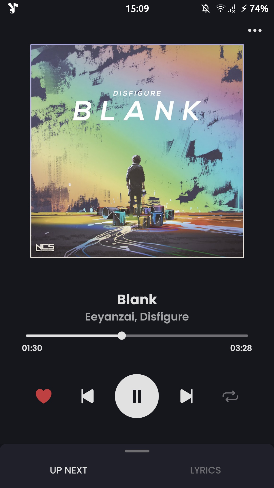
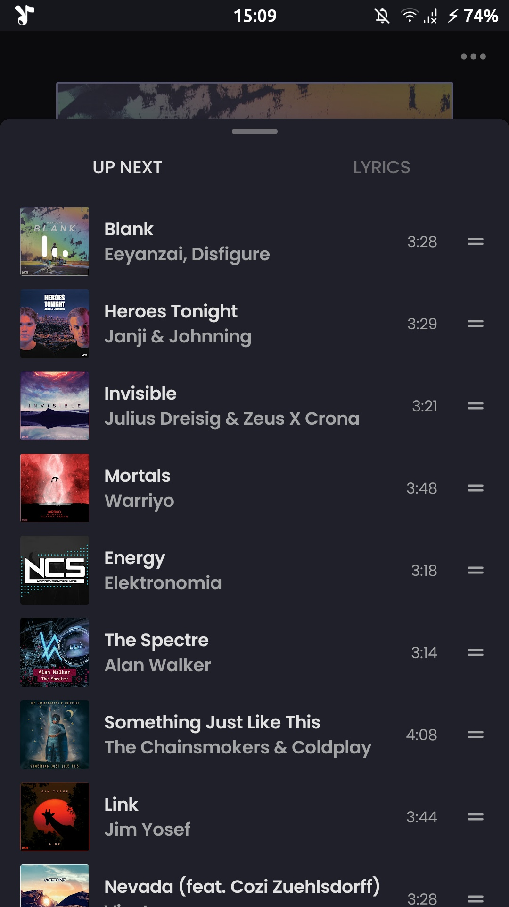
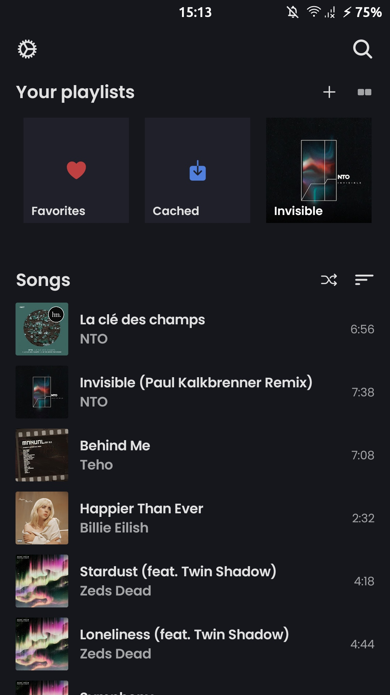
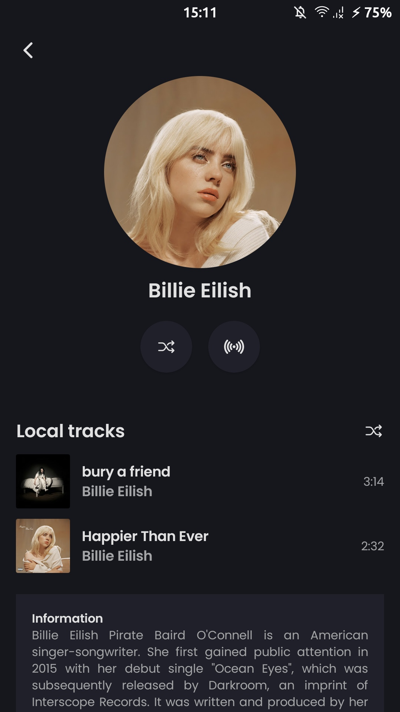
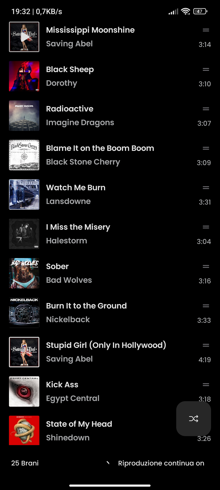

<div align="center">
    
    <h1>ViMusic</h1>
    <p>A Jetpack Compose Android application for streaming music from YouTube Music</p>

[](https://developer.android.com/jetpack/compose)
</div>

---

<p align="center">
  
  
  

  
  
  
</p>

## Features
- Play (almost) any song or video from YouTube Music
- Background playback
- Cache audio chunks for offline playback
- Search for songs, albums, artists videos and playlists
- Fetch, display and edit songs lyrics or synchronized lyrics
- Local playlist management
- Reorder songs in playlist or queue
- Light/Dark/Dynamic theme
- Skip silence
- Sleep timer
- Audio normalization
- Persistent queue
- Open YouTube/YouTube Music links (`watch`, `playlist`)
- ...

## Installation

[](https://f-droid.org/packages/it.vfsfitvnm.vimusic/)
[](https://github.com/vfsfitvnm/ViMusic/releases/latest)

After installing, I recommend executing the following ADB command to neutralize some animation lags you may experience in cold starts:
```
adb shell cmd package compile -r bg-dexopt it.vfsfitvnm.vimusic
```

## Similar projects, inspirations and acknowledgments
- [**Beatbump**](https://github.com/snuffyDev/Beatbump): Alternative YouTube Music frontend built with Svelte/SvelteKit.
- [**music**](https://github.com/z-huang/music): A material design music player with music from YouTube/YouTube Music.
- [**YouTube-Internal-Clients**](https://github.com/zerodytrash/YouTube-Internal-Clients): A python script that discovers hidden YouTube API clients. Just a research project.
- [**ionicons**](https://github.com/ionic-team/ionicons): Premium hand-crafted icons built by Ionic, for Ionic apps and web apps everywhere.
